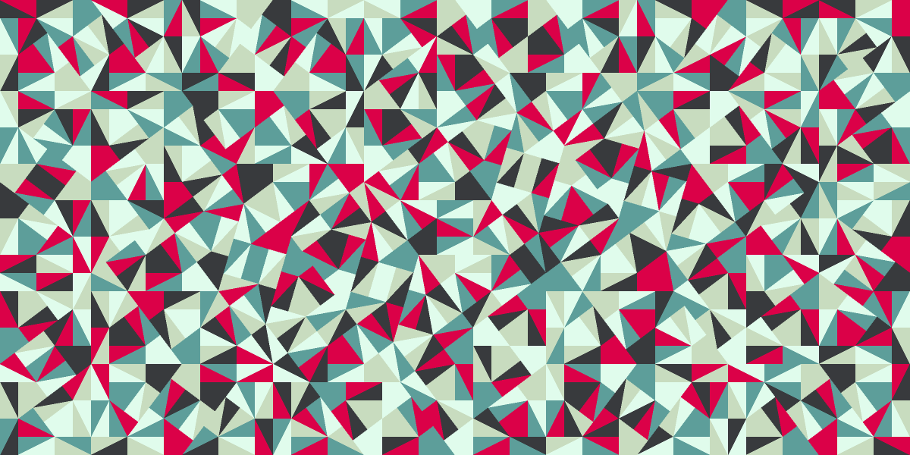

# Pinwheels

A PostScript program that draws a Pinwheel tiling.

Color palette: [København Pop][] by [isotope.151][],
used under [CC BY-NC-SA 3.0][].

## License

Copyright (c) 2015 Nora Gruner

Code licensed under [MIT License](LICENSE);
art licensed under [CC BY-NC-SA 3.0][].

[København Pop]:   http://www.colourlovers.com/palette/176004/København_Pop
[isotope.151]:     http://www.colourlovers.com/lover/isotope.151
[CC BY-NC-SA 3.0]: https://creativecommons.org/licenses/by-nc-sa/3.0/
